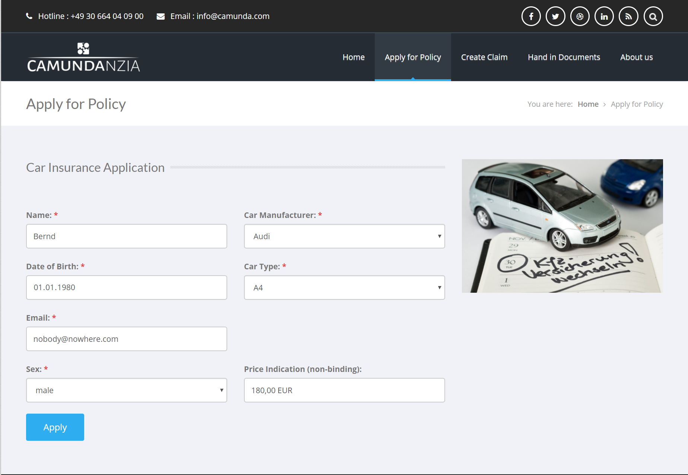
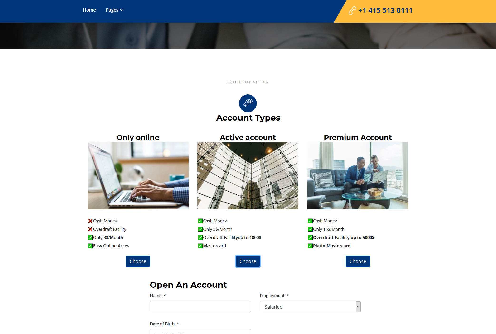
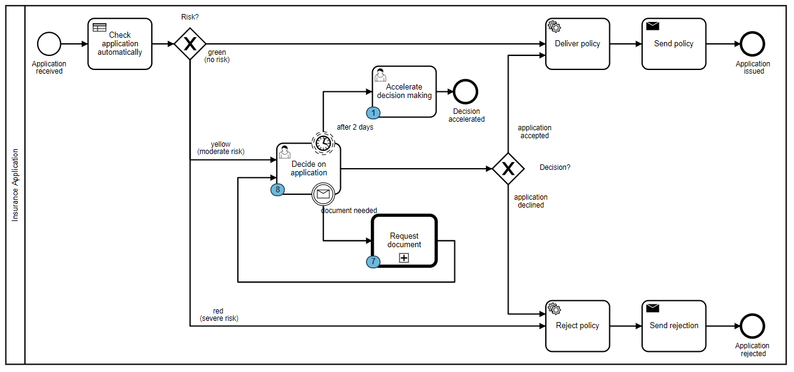

# Camunda showcase "Insurance Application" / "Versicherungsneuantrag"

# What it does
This demo showcases a simplified insurance or bank account application process using the Camunda platform for workflow and decision automation.

The project includes a simple self-contained, custom-made web frontend, which can be used to submit applications.
After deploymnet the web pages are available under:

* English: http://localhost:8080/camunda/online/index.html?lang=en
* German: http://localhost:8080/camunda/online/index.html?lang=de

On the landing page an insurance or banking frontend and the language can be selected.

Insurance application

Bank account application

The frontends start instances of the follwoing (BPMN) process via a simple REST API:

(src/main/resources/static/bpmn/customer_onboarding_en.bpmn)

The workflow first executes an automated decision (in DMN), determining if the application requires a manual assessment or can be process automatically:

(src/main/resources/static/bpmn/risk_check_en.dmn)

The camunda web applications will be accessible under http://localhost:8080/camunda

The user/password demo/demo can be used to login.
 

# Architecture
The showcase uses Spring Boot and the Camunda Spring boot starters. 
https://docs.camunda.org/manual/latest/user-guide/spring-boot-integration

Spring web is used for the REST services defined in *ApplicationOnlineFacade*

# How to build and run
1. clone project or download sources
2. build via Maven (*mvn clean package*)
3. run via Spring boot (*mvn spring-boot:run*) 

During startup the showcase **will generate test data**. This can take a few minutes.
You can already use the application during this time.
To start with a fresh database delete /camunda-db.mv.db and /camunda-db.trace.db.

Alternatively you can play online in the [Showroom](http://showroom.camunda.com/) without installing anything locally. The showroom is password protected and only accessible for camunda partners.

